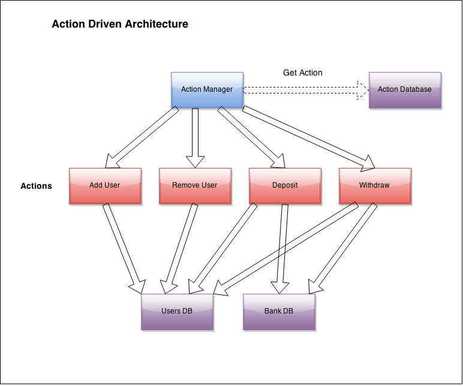

## 
-/UCL LOGO/-

# University College London

### Department of Computer Science

## MSc Summer Project Report

# QuantiTeam: Blockchain architecture as a medium to verify collaborative work
## A Feasibility Study

_Author:_ Benjamin Kremer  
_Supervisor:_  Dr. Ghita Kouadri Mostefaoui

_This report is submitted as part requirement for the MSc Computer Science degree at UCL. It is substantially the result of my own work except where explicitly indicated in the text. The report may be freely copied and distributed provided the source is explicitly acknowledged._

September 2016

***
***

# Abstract
*TODO*

***
***

# Acknowledgements
*TODO*

***
***

# Contents
*ToC TODO*

# List of Figures
*TODO*

# Abbreviations
*TODO*

***
***

# Chapter 1
# Introduction

## 1.1 Problem Outline
Motivation is the key to human action. Without it, the source of any action performed is likely to be grounded in external pressures rather than the actor’s desire to act. In adolescents and young adults, this situation frequently arises within a key element affecting their future: their education.  
**...TODO...**  
**...specific reasoning for WHY a blockchain...***

## 1.2 Project Goals
_(placement?)_  
This project began as an attempt to address this phenomenon of student disengagement and, over time, developed into a wholly larger investigation of whether it is possible to utilise blockchain technology not just to form a network of re-engaged students, but as a tool for the verification of group-based work at large.  
_(/placement?)_  
The major goals of the project were thus twofold: in a broader sense, to demonstrate how the properties of a blockchain can be leveraged in a social, communal context, rather than the financial contexts they are usually applied to, and more concretely, to create a free, open and extensible platform for students of all ages to re-engage with their peers in a productive, educational manner, underpinned by a model of motivation which rewards collaborative work as a team.  

Working from this technological and philosophical objective, respectively, the following specific goals for the project were established:
- Create a public API - built on a NodeJS server - to interface between users and a blockchain, independent of a chosen client-side implementation.
- _/Offer a straightforward upload functionality to the blockchain for task-related files via said NodeJS server./_
- Provide an iOS client-side app for basic task/user/team management to provide maximum accessibility and familiarity for users.
- Establish a basic deployment of at least 4 distributed validator nodes to provide a true proof-of-stake consensus mechanism _[REF]()_ for the platform.

## 1.3 Personal Aims
**TODO: Blurb**  
*Talk about following the bitcoin movement since before I even started coding.*  
*Maybe talk about Golang-Docker relationship and how this initially piqued my interest in Docker*  
Having been a follower of the bitcoin _[REF]()_ movement for more than two years, the author has been looking for an appropriate opportunity to apply the blockchain data structure, which underpins bitcoin's public ledger, to a project of his own. This project's partial goal of verifiability of team work fits a blockchain's ability to provide a pseudo-anonymous public ledger of transactions or events.  

*(Facebook's React Native _[REF]()_ was chosen for client-side development after using React _[REF]()_ and Cordova _[REF]()_ heavily in a previous MSc project to provide a mobile application, but being unsatisfied with both the stability and interactive feel of the final product. to provide the simplest but powerful UX possible for a complex backend.)*

The following points provide an overview of the author's personal aims for the project:
- Gain familiarity with native app development by utilising existing JavaScript knowledge via React Native.
- Learn how to write smart contracts in Solidity _[REF]()_ that are useful in the context of the project and for existing platforms such as Ethereum _[REF]()_.
- Implementing a form of blockchain technology (in this case proof-of-stake), by learning how to set up, run & maintain a a blockchain proficiently.
- Gain a fundamental understanding of Docker _[REF]()_ and how it leverages _"containerisation"_ to provide ease of environment deployment.

## 1.4 Project Management
The project followed the methodology of the Unified Process (henceforth UP) framework _[REF]()_. Given the circumstances of two-thirds of the technologies being familiar to the author, whereas the blockchain aspect was almost entirely new ground, implementing **TODO: model x** made the most sense for the project.  
Given the limited amount of time available for a project of these dimensions, along with the research and experimentation required to validate whether the described goals were even achievable, user requirements were captured using a heuristic of what the essential functionality would be for the client-side application, and thus the API in general, in order for a user to create, manage and discuss their open tasks with their team. This was done by utilising the MoSCoW categorisation scheme _[REF]()_.  

The system was at first modeled with a theoretical deployment diagram in order to gain an understanding of which technological entities were required to neatly encapsulate responsibilities. Sequence diagrams were then used for more complex client-server-blockchain interactions at each new stage of the UP, where a new stage usually took the form of defining and implementing a new domain of the API, e.g. task management or user management.

As the API continued to grow laterally, adding an array of endpoints for each new domain, unit testing the API's public functions became an essential part of the project workflow. Due to the primitive error handling of the still very young language Solidity (used to construct smart contracts for blockchains), any responses coming from the blockchain had to be rigorously tested server-side in order avoid silent breakages and regressions.

**TODO: Github Isses + waffle.io**

**TODO: add UP diagram**  
**TODO: add Gantt chart?**

## 1.5 Report Overview
**TODO**

***
***

# Chapter 2
# Background Information and Related Applications

## 2.1 Blockchains & Dropouts
(__intro is suboptimal__)  
A 2004 study by the National Research Council showed that upwards of 40% of high school students feel disengaged from learning and exert little effort on school work [(Center on Education Policy 2012)](http://cep-dc.org/displayDocument.cfm?DocumentID=405 ). More worryingly still, 70% of dropouts stated lack of motivation, in a 2006 study, as the key reason for their departure from school [(Bridgeland, J.M. et al., 2006. The Silent Epidemic: Perspectives of High School Dropouts)](). In liaison with these findings, a study which tracked the educational careers of a group of individuals found that 23% of those who dropped out cited a sense of not belonging as the reason for their departure from school [(Berktold et al., 1998, Table 6)]().  

While the factors for a student's motivation (or lack of it) regarding their education may stem from a myriad of factors, engaging the individual on a social level may thus be posited as a key driver in motivating them to remain engaged in the process [((Johnson et al., 2001; Newmann, Wehlage, and Lamborn, 1992; Tinto, 1993; Wehlage, Rutter, Smith, Lesko, and Fernandez, 1989))](). Of course, simply being bound into a social context does not mean that the student will make meaningful progress regarding their work, as attendance does not constitute attention to what is being taught [(_ibid_)]().  

Whereas there is little school staff can do to ensure the attention of a student within a physical school, supplementing the educational process with blockchain-based technology may provide a solution to this impasse between the individual student's aims and that of the educator. By establishing a system in which collaborative work is directly linked to both an individual and social reward, students are able to focus on a more immediate & manageable target than an abstract and potentially far-off seeming concept of a high school diploma.

> “Rewarding specific actions that students can control, such as completing homework, yields better results than rewarding accomplishments that may seem beyond their reach or out of their control” [(Usher, Kober; Student Motivation - An overlooked piece of school reform)]() **TODO confirm this quote, is this the full sentence?**

Using a blockchain as a data structure – in this case one which is built on a proof-of-stake consensus algorithm – to register, manage and save school-related educational tasks, along with a reward & ranking scheme linked to the blockchain, would enable students to reap immediate rewards from their individual & collaborative efforts. Furthermore, a blockchain's ability to as a pseudo-anonymous public ledger of events, in this case school-related tasks, would provide students with the ability to refer back to said tasks at a later point in time to demonstrate their teamwork skills, therefore making a previous scarcely confirmable skill set auditable.

## 2.2 Previous Work/Existing Applications
This section gives an overview of related work within the context of heightening student engagement described above.
- **(review this, maybe mention how there doesn't seem to be a blockchain-based collab tool => none of the related work has data security via distributed network)**
- **closed vs open stance, i.e. licensing?**

#### SocialX[(Learning from peers: motivating students through reputation systems )](#needsLink), [(Collaborative projects and self evaluation within a social reputation-based exercise-sharing system )](#needsLink)
SocialX is an exercise sharing tool which enables students to earn reputation points, which are visible to their peers and the given subject's teacher, by submitting solutions to exercises. A further source of reputation are endorsements, which a student may receive from their peers if they were inspired to reuse the student's solution. SocialX differs to QuantiTeam in three key ways: firstly, reputation within SocialX is calculated according to factors which involve the judgment of each other's work, whereas in QuantiTeam's reputation is a function of team size and is either rewarded in full to all team members or not at all, depending on whether the task/exercise in question was completed. Secondly, QuantiTeam has no teacher role, and is therefore able to avoid a bottleneck SocialX suffers from. Thirdly, SocialX defines the term "global ranking" as a measurement of student reputation across subjects/courses, whereas QuantiTeam strives for a truly global, decentralised ranking system.

#### WikiSpaces[(WikiSpaces)](https://www.wikispaces.com/content/classroom/about)
**TODO**

#### HaikuLearning[(HaikuLearning)](https://www.haikulearning.com/)
**TODO**

## 2.3 Programming Languages and Libraries
### 2.3.1 Blockchain
**Definition of what a blockchain & smart contracts even are?**

At the outset of the project, a key choice which had to be made was the choice of blockchain implementation to be used. This decision was critical as discovering a major flaw in the implementation, or an incompatibility between what the implementation could provide and what was needed, would have resulted in deadlock for the entire project.  
The author's initial experimentation with OpenChain[(OpenChain)](https://www.openchain.org/), which seemed to offer the possibly useful ability to chain contracts (i.e. tasks) to each other, was quickly abandoned as the available documentation was insufficiently detailed and partially ambiguous. This would have left the project open to a lot of "stabbing in the dark"**(<--rephrase)** and thus the above mentioned risk of deadlock.  
MultiChain[(MultiChain)](http://www.multichain.com/), on the other hand, was an implementation which had well-defined documentation, but it assumed a level of pre-existing familiarity with the API of a blockchain, as well as providing preciously little context as to how smart contracts could be developed for the platform in an effective way.  
The apparent drawbacks of the two mentioned blockchain implementations therefore led the author to the Eris[(Eris)](https://erisindustries.com/) platform. Eris itself provides a suite of tools which wrap and augment a Tendermint[(Tendermint)](http://tendermint.com/) blockchain implementation. Eris's wealth of documentation and its well-structured command line interface (henceforth CLI) were the deciding factor in it being the blockchain implementation of choice. The documentation provided not only step-by-step examples of how a developer could configure and deploy a blockchain, but also provided in-depth tutorials and examples on how to write & deploy Solidity[(Solidity)](http://solidity.readthedocs.io/en/latest/) smart contracts for the platform, highly valuable for a smart contract novice such as the author. Furthermore, the fact that Tendermint is an entirely separate software project meant that there was also an entire repository of documentation for this specific type of blockchain and the computer science theory backing it.  

**mention that Solidity was basically the only contract lang choice?**

### 2.3.2 Server-side
Considering the author's background as a JavaScript developer, the natural choice for a web server for the project was NodeJS[(NodeJS)](https://nodejs.org/en/). NodeJS provides a great level of flexibility and extensibility thanks to its huge ecosystem of open-source libraries available through its package manager, NPM[(npm)](https://www.npmjs.com/), thus providing an essential basis to help mitigate the possibly complicated technical details of interfacing with a low-level blockchain.  
As JavaScript is an ever-evolving language, a choice had to be made as to whether the commonly supported ECMAScript[(ECMAScript)](http://www.ecma-international.org/) 5 (ES5) specification should be used or the modern standard, ES6. ES5 was selected to provide the maximum level of compatibility for wherever the server is being deployed, as native support for ES6 is not wide-spread as of the point of writing and transpiling the server's code from ES6 to ES5 for each deployment would have been a lot more trouble than help for a regular web server.  

The server-side implementation makes use of a handful of key libraries:

#### Express
Express[(Express)](https://expressjs.com/) is a minimalist framework for NodeJS web servers which provides a powerful layer of abstraction on top of NodeJS's raw server interface. Express helped accelerate the development of the API, while leaving the possibility of fine-tuning the NodeJS server itself intact.

#### eris-wrapper & eris-logger
The eris-wrapper & eris-logger modules were adopted from a "Hello World"-style example Eris provides to showcase how a NodeJS server implementing their platform could be structured[(Hello Eris)](https://github.com/eris-ltd/hello-eris).  
eris-wrapper provides a convenient abstraction of low-level bindings that have to take place between the NodeJS server and the Tendermint blockchain, while eris-logger simply sets up a simple logger with different levels of urgency, such as `ERROR`, `INFO` and `DEBUG`.  

#### Async
Async[(Async)](https://caolan.github.io/async/) is a utility library which helps manage the flow of asynchronous functions, which are a common occurrence in NodeJS. Within the scope of the server, Async was primarily used to chain together multiple sequential interactions with the blockchain.

#### bcrypt
**TODO (?)**

### 2.3.3 Client-side
During the MSc's GC02 "App Design" course, the author and his team had the opportunity to build a React web application which was also required to run as a mobile application. This was achieved by wrapping the web app with the Apache Cordova[(Cordova)](https://cordova.apache.org/) mobile development framework. This experience revealed two key insights regarding the intersection between web- and mobile-based client-side development:  
Firstly, that Facebook's React[(React)](https://facebook.github.io/react/) web development library, in liaison with Dan Abramov's Redux[(Redux)](http://redux.js.org/) library for data management, could be applied almost seamlessly to the context of a mobile application. React's philosophy of thinking in terms of individual view components, together with Redux's implementation-agnostic approach to managing the application's state, largely abstracted away the conceptual differences between building an HTML document and building a mobile app view.  
Secondly, that porting a web app to a mobile app simply does not provide an authentic native experience on a mobile device, as it is almost impossible to account for and implement all the differences and individual nuances in, for example, animation styles between mobile operating systems. This resulted in the look & feel of the application being closer to that of a mobile browser rather than a native mobile app.

Based on these two lessons learnt, the decision was made to use Facebook's React Native[(React Native)](https://facebook.github.io/react-native/) for the project, which grafts a truly native mobile development framework on top of the outstanding React library, along with the now familiar Redux library.  
React Native offers all the benefits of React (high levels of modularity & encapsulation, composability) while allowing the developer to hook into events and effects of the native mobile operating system. This means that transitioning between views smoothly or sending a push notification, for example, becomes a trivial undertaking.  
Redux provides a well-defined interface to manage the state of the application's data by managing all of it through a centralised `store` object, the contents of which can be altered exclusively by a set of actions previously defined by the developer. This provides a level of clarity of how the application's state mutates over time that is hard to achieve in a traditional Model-View-Controller (henceforth MVC) approach, in which many controllers have access to the application's state simultaneously.

Further libraries which play a key role within the client-side application are the following:

#### redux-thunk
redux-thunk[(redux-thunk)](https://github.com/gaearon/redux-thunk) is a helper library which enables the use of asynchronous functions as the aforementioned actions, which affect the application's state. This is essential to allow control over how and when the client application sends data to the blockchain, and how it fetches data from the blockchain to then integrates it into its local state.

#### redux-persist (?)
**TODO (?)**

#### redux-logger
redux-logger[(redux-logger)](https://github.com/evgenyrodionov/redux-logger) supplements Redux itself by automatically logging actions the state changes they trigger to the development console. This meant a significant amount of time could be saved in avoiding a custom implementation of a logger, or worse yet, littering the codebase with sporadic logging statements.

#### tcomb-form-native
tcomb-form-native[(tcomb-form-native)](https://github.com/gcanti/tcomb-form-native) provides a framework for forms and form validation in React Native. As form validation in particular can take up an inordinate amount of development time, this library was essential in order to keep the project on track given the severe time constraints relation to its size.

### 2.3.4 Testing
Composing unit tests for each public function of the system's API was an essential part of the development process, especially as the Tendermint blockchain was able to report errors within its own processes to the NodeJS server only in the most rudimentary of terms. This meant that if no testing suite was in place, silent breakages and undefined behaviour were likely to occur as the API grew.  

The following JavaScript libraries were used to implement a suite of unit tests on the server:  

#### Mocha
Mocha[(Mocha)](https://mochajs.org/) was chosen as the testing framework for the project due to its specific aim of simplifying the testing of asynchronous JavaScript code. This clearly applied to the needs of the planned API which would be largely built on asynchronous functions.

#### Chai
Chai[(Chai)](http://chaijs.com/) is an assertion library for both test-driven development (TDD) and behaviour-driven development (BDD). More specifically, Chai's TDD `assert` function was used to keep test assertions simple and testable against an expected result.

#### Istanbul
Istanbul[(Istanbul)](https://gotwarlost.github.io/istanbul/) is a code coverage tool which was used to gain an overview of how much of the API was currently covered by tests. This occurred via coverage reports, which were generated after every run of the test suite.

### 2.3.5 Databases: SQL vs NoSQL vs Blockchain -/location?/-
Using a blockchain as the pivotal data structure backing the system evoked an interesting question: could the entire system be built in a way that did not, at any point, rely on a traditional database to store data? This would automatically provide the ability to have a distributed database, assuming there are is more than one full-index blockchain node, avoiding any central point of failure and thus the potential for catastrophic data loss. Furthermore, this approach would be the significantly more cohesive one in terms of system architecture. Adding a further external data source, to manage auxiliary data which didn't neatly fit into the task management duties of the blockchain's smart contracts, would have introduced a further agent within the planned API, thus significantly increasing the complexity of data retrieval and storage operations.  

Yet, this approach could also have a significant impact on the size efficiency **(?)** and integrity of the stored data. Unlike with a typical SQL or noSQL database, there is – to my knowledge **(review this)** – no commonly accepted approach as to how data should be structured in terms of smart contracts for persistent storage in a Tendermint blockchain. This meant an initial attempt at implementing an interface to do so would possibly contain inefficiencies and anti-patterns in terms of data relations.  

After weighing up the above-mentioned points, the choice was made to go ahead and attempt to store all data generated by the system within the blockchain, as choosing to add a further form of database would likely have been significantly more bug-prone and costly in terms of development time.

## 2.4 Tooling
### 2.4.1 Requirements and Design Tools
GanttPro[(GanttPro)](https://ganttpro.com/), an online creator and editor for Gantt charts, was used to create a timeline for the project, while Google Docs[(GoogleDocs)](https://www.google.com/docs/about/) in conjunction with draw.io[(draw.io)](https://www.draw.io/) were used to capture requirements and create UML diagrams.  
This document was written in markdown and transpiled to Latex format using pandoc[(pandoc)](http://pandoc.org/).

### 2.4.2 Development Tools
#### Editor
In order to avoid switching between editors to get the best development support for disparate parts of the project's code, Github's Atom[(Atom)](https://atom.io/) editor was chosen due to its level of customisability and huge selection of plugins. Atom was particularly suited for writing React Native code thanks to Facebook's Nuclide[(Nuclide)](https://nuclide.io/) plugin, which enables Atom to approximate the richness of features that is typically only offered by Integrated Development Environments (IDEs) by offering an in-built debugger, code snippets, and Facebook's own static type analyser which is discussed below.

#### Static Type Analyser
Flowtype[(Flowtype)](https://www.flowtype.org/), a static type analyser for JavaScript, is a further in-built feature of the Nuclide plugin. Flowtype enables the developer to define a type for a variable, a type signature for a function, and even to create custom union & intersection types. Flowtype then checks whether the defined type specifications are adhered to and warns if it detects a TypeError. This is an incredibly useful tool for a dynamically-typed language such as JavaScript, where unintended type coercion is a common ailment.

#### Linters
**Define term "linter"?**  
ESLint[(ESLint)](http://eslint.org/) was chosen as the linter for both the React Native app and the NodeJS server, due to its support for detecting semantic & stylistic errors in both regular JavaScript and JSX, a mix of JavaScript and HTML used by Facebook for React.  
For the smart contracts, written in Solidity, the `solidity-linter`[(solidity-linter)](https://atom.io/packages/linter-solidity) Atom plugin was used, which avoided a significant amount of frustration in comparison to waiting for errors to be detected at compile-time by the Solidity compiler built into Eris's tooling.

#### Debugging
Debugging within the project was performed in three different ways due to the variability of environments within the technology stack. For the React Native app, Google Chrome's DevTools[(devTools)](https://developers.google.com/web/tools/chrome-devtools/?hl=en) were utilised alongside the Xcode iOS simulator[(iOS Simulator)](https://developer.apple.com/library/ios/documentation/IDEs/Conceptual/iOS_Simulator_Guide/Introduction/Introduction.html) in order to interact with the app and receive log outputs side-by-side in realtime.  
For the NodeJS server, the aforementioned `eris-logger` module was used to log API-related logging statements to the terminal.  
At the bare-metal level, Eris provided a way of continuously logging the activity of the Tendermint blockchain. Due to all operations approximating those of assembly language and thus being represented in hexadecimal, this was not useful in terms of locating bugs, but it provided a sanity check to ensure that the chain was performing the expected operations when instructed to do so by the NodeJS server, excluding a possible cause if a bug was being looked for.

#### Version Control
The `git`[(git)](https://git-scm.com/) command line utility was used to manage the codebase's development over time, in conjunction with GitHub[(GitHub)](https://github.com/) to provide a remote backup. For more involved `git` operations, such as merging branches, Atlassian's SourceTree[(SourceTree)](https://www.atlassian.com/software/sourcetree) GUI was used to avoid typing complex terminal commands and thus potentially performing unwanted changes to the version history.

#### Docker & Shell Scripts
Docker[(Docker)](https://www.docker.com/) is a platform which allows the creation of a standardised images for software development to mitigate arbitrary local differences between development environments. It was an essential part of the development process as Eris's tooling leverages Docker heavily to deploy blockchain instances.  
In order to automate the process of booting the Docker virtual machine and the local blockchain instance, the required sequence of commands was packaged into a Bash shell script, `envsetup.sh`, shown below.

**TODO: insert envsetup.sh**

***
***

# Chapter 3
# Requirements and Analysis

## 3.1 Problem Statement
**TODO: reiterate from Ch.1?**

## 3.2 Requirements
In a typical software engineering project, there is a need for strong levels of communication between all the stakeholders involved in the endeavour, in order to ensure all the needs the software should meet are in fact met _[(REF)]()_. A frequent phenomenon within these interactions is that requirements are revealed to the development team in a haphazard way or are simply misinterpreted by the team _[(REF?)]()_.  
Fortunately these common pitfalls were a moot point within this project, as the act of establishing requirements was entirely focused around the question: "What functionality does the system require, at a minimum, to fulfill its stated aims?". This provided a clear focus on what was absolutely needed for a minimum viable product (henceforth MVP)[(MVP)](https://www.techopedia.com/definition/27809/minimum-viable-product-mvp) that an individual and/or group of individuals could use in a meaningful way. This meant both functional and non-functional requirements were focused around three domains: tasks, users, and teams. The requirements were prioritised according to the MoSCoW system[(MoSCoW)](https://www.dsdm.org/content/moscow-prioritisation), with requirements being ranked from "Must Have" through "Should Have" and "Could Have", with the final category being "Won't Have (in this development cycle)". The project's "Must Have" requirements had to be strictly limited to what was  as there was a large number of known unknowns (e.g. the Solidity language) and unknown unknowns (unforeseeable issues with the API, blockchain or development environment). The "Should Have" and "Could Have" categories therefore largely express targets for more sophisticated future iterations of the system.  

**TODO: include functional & non-functional requirements tables**

## 3.3 Use Cases
To remain realistic in regards to the allotted time for the project, use cases were aimed at providing a full exploration of the API rather than a rich user experience within the first iteration of the system, therefore ensuring that the API could remain agnostic regarding any particular client-side context.  
Use cases for the client-side application and the API itself were therefore straightforward, as the only actors within the initial scope of the system were the individual user and the user as part of a team, meaning there was no need for elevated permissions within the API or specialised UI interactions, as one might see with an administrative dashboard in other applications.

Use cases were constructed in parallel with the initial UI sketches, thus helping to visualise the flow of user-system interactions.  
**Figure xx** below represents an overview of the uses cases that were constructed, while the detailed use cases can be reviewed in **Appendix X**.  

**TODO ref for use case template, Arlow & Neustedt**  

ID    |  Use Case             |  Primary Actor  |  Secondary Actor
------|-----------------------|-----------------|-----------------
UC1   |  Signup               |  User           |  System         
UC2   |  Login                |  User           |  System         
UC3   |  AddTask              |  User           |  System         
UC4   |  ViewTasks            |  User           |  System         
UC5   |  TaskComment          |  User           |  System         
UC6   |  OptOutOfTask         |  User           |  System         
UC7   |  CheckTaskCompletion  |  User           |  System         
UC8   |  ExternalLinkToTask   |  User           |  System         
UC9   |  CreateTeam           |  User           |  System         
UC10  |  CheckTeamScore       |  User           |  System         
UC11  |  RequestHelp          |  User           |  System         
UC12  |  OfferHelp            |  User           |  System         
UC13  |  MuteNotifications    |  User           |  System         
UC14  |  EditAccount          |  User           |  System         
UC15  |  SetProfilePicture    |  User           |  System         
UC16  |  DeleteAccount        |  User           |  System         

## 3.4 Sketches & Wireframes
**TODO**

## 3.5 System Design
The design of the system's architecture started with creating a simple deployment diagram **(fig X)**, which provided a high-level view of the system's required components and the roles they would play.  
Establishing a high-level understanding of what the system required to provide an API for proficient communication between any client application and the Tendermint blockchain.

_Figure x_

### 3.5.1 Smart Contract Analysis
The concept of a smart contract is usually evoked in terms of a digital protocol which enforces and/or verifies the performance of a contract between two or more parties[(smart_contracts_idea)](http://szabo.best.vwh.net/smart_contracts_idea.html). Within the context of this project the role of the smart contracts played was more closely related to that of typical classes in object-oriented programming _[(REF?)]()_, with the majority of the contracts either acting as factories[(factory pattern)](http://www.oodesign.com/factory-pattern.html) for composite types or implementing operations on these types as "manager" contracts.

#### Factory Contracts
In order to define composite types, known in Solidity as `struct`s, a contract was defined for each domain of the system as revealed by the requirements. This meant there was a need for `User`, `Team` and `Task` contracts.

#### Data Structure Contract
Solidity – as a young and constantly developing language for smart contracts – does not currently provide a way to iterate over storage arrays. The language's version of objects, the `mapping` type, which approximates what is usually known as a hash map, is also non-iterable. This meant a custom data structure contract was needed to store, edit and retrieve collections of type contracts.

#### Manager Contracts
To avoid violating the Single Responsibility Principle[(SRP pattern)](http://www.oodesign.com/single-responsibility-principle.html) of object-oriented design, there was a need for a set of contracts which would perform operations on instances returned by the factory contracts. This meant there was a need for a `UserManager`, `TeamManager` and `TaskManager` contract.

#### Linker Contract
The previously discussed decision to encapsulate all data generated by the system within the blockchain led to an issue of data relations amongst the contracts: How could a new `Task` contract be linked to the appropriate `User` contract if there was no structured way to do so in comparison to, for example, an SQL interface? This meant there was a need for a higher-oder `Linker` contract, dedicated to locating and linking related contracts in such a situation.

Simplified class diagram to illustrate the relationships between Factory, Manager and Linker contracts.

#### Action Events
Solidity's lack of any real logging capabilities meant there needed to be consideration in regard to how function calls within contracts could be observed from the outside. Solidity does, fortunately, provide an `event` type, which opened up the possibility of triggering such an `event` where required and listening for it server-side, where logging the events was a trivial matter.

**-/BEGIN relevant?/-**  
The diagram below shows how smart contract actions could be structured. Within this initial iteration of the project, contracts like the `UserManager` were themselves responsible for dispatching action events related to their methods, as the level of abstraction shown would only become useful once the API grew to a larger scale, enabling actions to be centrally processed by an `ActionManager` and then cascading to their relevant Manager contracts.

Source: https://docs.erisindustries.com/tutorials/solidity/solidity-2/

**-/END relevant?/-**  

### 3.5.2 Server-side Analysis
Once the structure of the smart contracts had been established, the analysis of the server-side implementation quickly revealed that the server's structure would largely mirror that of the smart contracts. This was the case partially due to the way Eris's JavaScript library was implemented, but largely due to the fact that this would keep the the final API succinct and free of unnecessary cognitive load for the author and for any future developers.  
The server would therefore simply act as a relay and transformer for data travelling between the client-side application and the blockchain, acting as a _de facto_ middleman. In more concrete terms, this would involve calling relevant contract methods on the blockchain when a certain API endpoint was requested and transforming data between hexadecimal and UTF-8, for example. This is necessary due to Solidity's poor support for strings at the time of writing, meaning that all strings would have to be encoded into 32-byte fields of hexadecimal, known in Solidity as the `bytes32` type.

**TODO 2-3 sequence diagrams**

### 3.5.3 Client-side Analysis

***
***

# Chapter 4
# Design and Implementation
_"Program to an interface not an implementation."_
