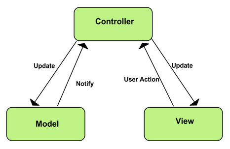

# Chapter 4
# Design & Implementation

## 4.1 System Architecture
QuantiTeam broadly follows the three-tier architecture of a typical Model-View-Controller<sup>[(Krasner, Glenn E., and Stephen T. Pope. "A description of the model-view-controller user interface paradigm in the smalltalk-80 system." Journal of object oriented programming 1.3 (1988): 26-49.)](http://heaveneverywhere.com/stp/PostScript/mvc.pdf)</sup> (henceforth MVC) application with the important distinction that the roles within the MVC pattern are applied to an entire system of various applications, rather than a single application. In concrete terms, this means that blockchain represents the Model element by establishing the system's data model through the smart contracts applied to it, while the NodeJS server represents the Controller element, providing a public interface for client applications to issue requests to the blockchain and handling raw responses from the blockchain. The "View" element of the implementation is therefore interchangeable, as the RESTful API formed by the web server and the blockchain provides a uniform set of endpoints to communicate with, tying no special or unique value to the client, in this case a mobile app.

  
Source: https://developer.chrome.com/apps/app_frameworks

In order to mirror the described approach of creating a standalone unit out of the Model and Controller aspects of the system's architecture, the project's source code was structured into two directories at the highest level. As represented by the shallow file tree below, the `app` directory contains the React Native client-side application, while the `chain` directory holds configurations and environment variables to run the Tendermint blockchain via the `eris` CLI, and provides the REST API server in its `js` subdirectory.  

```
.
├── app
│   ├── android
│   ├── index.android.js
│   ├── index.ios.js
│   ├── ios
│   ├── js
│   ├── node_modules
│   └── package.json
├── LICENSE
├── README.md
├── chain
│   ├── Dockerfile
│   ├── abi
│   ├── accounts.json
│   ├── app.js
│   ├── config
│   ├── contracts
│   ├── envsetup.sh
│   ├── epm.json
│   ├── epm.yaml
│   ├── js
│   ├── logs
│   ├── node_modules
│   ├── package.json
│   ├── simplechain.sh
│   └── test
├── log.md
└── npm-debug.log
```

## 4.2 Blockchain Design & Implementation
### 4.2.1 The Model
Within the MVC paradigm, models represent the central structure of the application and "are concerned with neither the user-interface nor presentation layers but instead represent unique forms of data that an application may require"<sup>[(Learning JS Design Patterns)](https://addyosmani.com/resources/essentialjsdesignpatterns/book/#detailmvc)</sup>.  
The Tendermint blockchain serves as a model by defining the system's domain through the collection of smart contracts it holds, thus setting the boundaries for what kinds of data the system is able to store and what kind of operations can be performed on the data.


### 4.2.2 Working with Solidity
To put a number of the design decisions made during the construction of the blockchain's smart contracts into perspective, some context regarding the current capabilities of the Solidity programming language is required.  

#### Strings and Numbers
As was briefly touched upon in chapter 3, Solidity is still in its infancy. This meant that some data types such as strings, had to be translated into fields of 32 byte arrays in hexadecimal when fed into the blockchain and translated vice versa when being retrieved from the blockchain.  
Furthermore, translating numeric values from a dynamically-typed language such as JavaScript to a strict, statically-typed one such as Solidity without side effects or data corruption is also no trivial task. A point which illustrates these possibly unpredictable side effects is the possibility of an unusually large integer being fed into the API by a client application, which is then translated to an 8-bit unsigned integer (`uint8`) field within a Solidity contract, thus writing an irreparably truncated and corrupted value to the blockchain.  
A conscious decision was therefore made to encode all values – aside from booleans which are able to move across the API unaltered – in hexadecimal before they are fed into the blockchain, regardless of initial type, to utilise Solidity's `bytes32` type. This approach provided two important advantages:

_Predictability_ - Transforming all data associated with the blockchain in a regular manner enhances the testability of the API by fixing the data's representation, both when it is entered into and retrieved from the chain. This increases the API's level testability by making expected outputs for a given input more uniform and free of special circumstances.  

_Simplicity_ - Establishing a standardised format for any data to be entered into the blockchain helped keep the API straightforward to work with. Any numeric or string data could be encoded for the chain by the NodeJS server using the `eris-wrapper` library module's `str2hex()` (string-to-hex) function, and decoded using its `hex2str()` (hex-to-string) function.  

#### Arrays and Objects
A further hindrance imposed by Solidity was its poor support for arrays and its lack of objects, also known as lists and dictionaries, respectively.

While JavaScript is composed entirely of objects, Solidity provides the `mapping` type; a data structure similar to what is commonly known as a hash map<sup>[(REF)]()</sup>. This would have provided a sufficient parallel to translate data formatted in JavaScript Object Notation<sup>[(JSON)](http://www.json.org/)</sup> (henceforth JSON) into a format digestible by Solidity contracts, were it not for the fact that Solidity's ability to store and perform operations on its mappings and arrays is limited at best. For example, storing user profiles (i.e. `struct`s) in a dictionary (i.e. a `mapping`) would have been possible, but retrieving a particular collection of dictionary entries would have been impossible, as neither Solidity's arrays nor its `mapping` type are iterable data structures by themselves. More specifically, a `mapping` can only be "probed" for a specific value, making it impossible to iterate over the structure and retrieve a subset of its properties which match a given criteria. This would have meant searching the blockchain in any non-trivial manner would have been highly unfeasible.  
To mitigate this functional bottleneck in Solidity, the author adopted an implementation of a SequenceArray<sup>[(_Data Structures And Algorithm Analysis in Java, p. 97_)]()</sup>, which became the `SequenceArray.sol` contract. The SequenceArray provided a well-defined interface of methods on top of Solidity's native array and `mapping` types, allowing the author to focus on _when_ and _why_ data should be manipulated or searched, rather than _how_ these operations are performed.

### 4.2.3 Smart Contracts
#### Data: Factory Contracts
The blockchain's factory contracts were a straightforward undertaking, both in regards of design and implementation, as their only role was to return a new instance of the contract, which would then be handled by the associated manager contracted. This meant the factory contract, in its simplest form, would contain its required fields and a constructor, as shown below:

```js
contract Task {

    bytes32 public id; // immutable
    bytes32 public title; // mutable
    bytes32 public desc; // mutable
    bytes32 public status; // mutable
    bytes32 public complete; // mutable
    bytes32 public reward; // immutable
    bytes32 public participants; // mutable
    bytes32 public creator; // immutable

    // Constructor
    function Task(
        bytes32 _id,
        bytes32 _title,
        bytes32 _desc,
        bytes32 _status,
        bytes32 _complete,
        bytes32 _reward,
        bytes32 _participants,
        bytes32 _creator
        ) {
        id = _id;
        title = _title;
        desc = _desc;
        status = _status;
        complete = _complete;
        reward = _reward;
        participants = _participants;
        creator = _creator;
    }
}
```

Solidity's inability to process an externally passed JavaScript object is nicely exemplified here, due to the sheer verbosity of the constructor function. While a task could be encapsulated as a single object and therefore passed as a single parameter within the client- and server-side JavaScript applications, the object had to be split into its constituent fields by the NodeJS server before it could be handed to the blockchain. This created what is commonly referred to as a "code smell"<sup>[(Tufano, Michele, et al. "When and why your code starts to smell bad." Proceedings of the 37th International Conference on Software Engineering-Volume 1. IEEE Press, 2015.)](http://www.cs.wm.edu/~denys/pubs/ICSE'15-BadSmells-CRC.pdf)</sup>, by forcing the author to implement an excessively large amount of parameters. This made the both the factory contracts themselves and the server's methods that deconstructed the initial JavaScript object for the blockchain brittle, as any change to a factory contract's fields had cascading effects throughout the API, thus creating an unnecessary opportunity for bugs to appear if refactoring was not done in a meticulous manner.


#### Operations: Manager Contracts
As a contract type, Manager contracts are chiefly responsible for indexing and modifying instances of data domain contracts, returned to them by their respective factory contract. How a Manager-type contract fulfills this role is exemplified with the code snippet below, which is an extract from the `UserManager` contract's `addUser()` method:

```js
// ...
if (isOverwrite) {
    return 0x0;
} else {
    User u = new User(_id, _username, _email, _name, _password);
    userList.insert(_username, u);
    return u;
}
// ...
```

The method previously checks whether the username already exists in the `userList` sequence array and writes the result to the `isOverwrite` variable, indicating that this would be an "overwrite" rather than a "create" operation. If the username already exists `addUser()` returns `0x0`, a null pointer address, thus indicating to the NodeJS server that adding the user failed. This again exemplifies the rather primitive state of the Solidity language at the time of writing, as the null address has to serve as an implicit error due to the absence of an error type within the language.  
If `isOverwrite` is false on the other hand, the `UserManager` contract creates a new instance of the `User` factory contract by invoking `new User(...)`, returning a pointer address which indicates the position of the newly created `User` contract in the blockchain. This address is then inserted into `userList`, where entries are indexed by using the passed `_username` variable as a key, to facilitate later retrieval.

Furthermore, the flexibility provided by the data structure contract – in this case a sequence array – became especially clear during the implementation of the Manager contracts. A Manager contract could simply instantiate a `SequenceArray.sol` contract for its own purposes and use only the minimum amount of SequenceArray methods it required to fulfill its functions, by creating a wrapper function around the method, and adding additional context as required, such as logging an event:

```js
contract UserManager {
    SequenceArray userList = new SequenceArray();

    // other methods...

    function isUsernameTaken(bytes32 _username) constant returns (bool) {
        registerActionEvent("IS USERNAME TAKEN");
        return userList.exists(_username);
    }
    // ...
}
```

- **Shape of the Factory and Manager contracts determined the Node server's structuring almost entirely**

#### Relations: Linker Contract
The Linker contract, which is best described as a utility contract, is responsible for linking together instances of factory contracts. As one of the blockchain's primary purposes within QuantiTeam is to act as persistent storage layer, this type of functionality was required in order to emulate the entity integrity provided by primary key/foreign key relations between tables in a relational database<sup>[(primaryKey/foreignKey)](https://msdn.microsoft.com/en-GB/library/ms179610.aspx)</sup>.  
For example, when a user creates a new task, thus spawning a new `Task` contract via the `TaskManager`, the system should be able to later identify the creator of said task. A possible solution would have been to simply let the `TaskManager` contract establish the link itself. Although being the most obvious solution to the issue, it would not have scaled well across the suite of Manager-type contracts. As the author was aware that a similar need for linkage would arise again between `Team` and `Task` contracts, allowing each Manager-type contract to implement its own linking mechanism was a notion which seemed to call for a layer of abstraction. A separate `Linker` contract was therefore established, whose sole responsibility is to create relational links between different types of factory contract instances. To achieve this, each new instance of a `User` or `Team` contract also contains a `taskAddressList` sequence array. This list is used to hold addresses (i.e. pointers) of tasks related to this instance of a user or team within the system. The `Linker` contract is then responsible for adding relevant addresses to the `taskAddressList`, an action which is performed whenever a new task is created.  
The following sequence diagram illustrates how the system processes a user attempting to add a task to the blockchain, exemplifying how and when the `Linker` contract is invoked.


**Figure x - Sequence of events for an "Add Task" action**

**TODO Class diagram for contracts**

## 4.3 Server Design & Implementation
As touched upon in the server-side analysis, the REST API server's role is first and foremost that of a data transformer and relay, forming a bridge between the blockchain and any given client-side implementation. The following subsections initially present how the server was designed to adhere to principles of both the MVC and REST design patterns, followed by an exploration how the server performs its bridging responsibilities in concrete terms.


### 4.3.1 The Controller
Controllers can be regarded as an intermediary which sit between models and views, and are typically responsible for updating the model when changes in the view take place<sup>[(Learning JS Design Patterns)](https://addyosmani.com/resources/essentialjsdesignpatterns/book/#detailmvc)</sup>. Within QuantiTeam, the server is able to fulfill its role as a Controller component within the system's overarching MVC architecture, by being the deciding factor concerning the logic executed between the moment an HTTP request is received and the moment a response issued from the API. Furthermore, the server is also responsible for piping any changes in data in the client-side application to the blockchain. For example, the event of a user marking a task as "Completed" is persisted by the server forwarding this change to the blockchain and altering the relevant `Task` contract accordingly.


### 4.3.2 RESTfulness
REST, which is an acronym for Representational State Transfer, is a commonly used web development pattern which attempts to ensure reliability and scalability of the web service implementing it<sup>[(REST)](http://whatisrest.com/rest_constraints/index)</sup>. Within the context of QuantiTeam, achieving RESTfulness was key for the system's API, as this would help ensure the system's usefulness to any context of client-side implementation, rather than specifically a mobile paradigm.  
This subsection therefore describes the properties of a RESTful service and how each applies to QuantiTeam's server-side architecture.

#### Client-Server Dichotomy
Crucial to the creation of an implementation-agnostic REST interface is a separation of concerns between the client and server<sup>[(client-server)](http://whatisrest.com/rest_constraints/client_server)</sup>. Strictly separating client and the server roles from each other provides portability and replaceability, as the underlying implementation of either may change without affecting the standardised form of communication established by the REST interface.  
Within QuantiTeam, there is a clear client-server dichotomy between the server which is solely concerned with handling incoming requests, and the React Native client app, which requests data from the server and then decides how to represent said data to the user within its local state.


#### Stateless
Statelessness is a key constraint within the REST design, which holds that each request should contain all information required by the service to process the request, and the service's response should contain all the required data to fulfill said request<sup>[(statelessness)](http://whatisrest.com/rest_constraints/stateless)</sup>.  
Applied to QuantiTeam, the REST pattern's property of statelessness not only helped to decouple the system's architecture by avoiding the need for managing state across different applications, it was also the most feasible approach to enable a straightforward way of communicating with the Tendermint blockchain, due to the previously described frequent requirement to transform data as it travelled to and from the blockchain. Statelessness, in this context, meant that there was no need to worry about intermediate representations of the data being stored and inappropriately forwarded to either the client or the blockchain at a later point in time.

A simple example of how the server remains stateless while fulfilling its function as an API interface is shown in the following snippet, taken from the `server.js` module:

```js
app.post('/user/taken', function (req, res) {
    var username = req.body.username;

    log.info("POST /user/taken: ", username);
    userManager.isUsernameTaken(username, function (err, isTaken) {
        _handleErr(err, res);
        res.json({isTaken: isTaken});
    });
});
```

This example shows the `/user/taken` API endpoint, which is responsible for validating the availability of usernames. When a user tries to sign up in the client-side app, the server receives the proposed username in the request body (the only piece of information required for the API to fulfill the request), with which it calls the `userManager`'s `isUsernameTaken()` method. The method returns an `isTaken` boolean which is written to the `res` response object, thus providing all data necessary for the client to make a decision regarding the availability of the proposed username.


#### Cacheable
Responses from the REST service being implicitly or explicitly declared as cacheable or non-cacheable is a further component of a RESTful service<sup>[(cache)](http://whatisrest.com/rest_constraints/cache)</sup>, as cacheable responses provide an opportunity to to optimise the amount of client-server communication that is needed.  
QuantiTeam's API currently does not provide explicit cache labels in its responses and is therefore implicitly cacheable on the client side. While cacheability is key to scaling a developed API, investing significant amounts of time to implement explicit cache invalidation within QuantiTeam's first iteration was outside of the project's scope. Implicit caching takes place within the React Native client-side app, which retrieves and then locally retains static information such as the user's profile data, for example.


#### Uniform Interface
A uniform technical interface – which provides a generic, high-level method of communication across all services within a REST architecture – is seen as the primary constraint which distinguishes the REST approach from other approaches to web service architectures<sup>[(uniform interface)](http://whatisrest.com/rest_constraints/interface_uniform_contract)</sup>.  
For QuantiTeam, this interface was constructed by using HTTP URI paths to define API endpoints, which a client could then issue requests to. Uniformity was further enforced by creating the following semantic template which all of the URI paths defined for the API would follow:

`/<data-domain>/<optional-subdomain>/:<optional-parameter>`

This URI template declares that the first path segment is mandatory and shall be the data domain the request is directed towards, for example `/user` or `/tasks`.  
The second segment may be composed of a further specification within the data domain, such as `/profile` for `/user`, thus forming the path `/user/profile`.  
The third and final segment consists of an optional request parameter, such as `:username` which may be used to pass a parameter to the API in a HTTP GET request. Building on the previous example, we may therefore be able to request the profile data for user `foo` by issuing a request to the API via the path `/profile/user/foo`.

By requiring all interactions with the API to take place in this form, the system is thus able to guarantee a high level of independence from concrete implementation details, as the requirements and formatting of HTTP do not vary across implementation contexts.


#### Layered System
The final constraint within the REST pattern concerns composability. A RESTful implementation should allow for intermediate layers, commonly known as middleware, to be inserted into the service without affecting the interface for communication in any way<sup>[(layered system)](http://whatisrest.com/rest_constraints/layered_system)</sup>.  
QuantiTeam meets this constraint through its HTTP URI interface, which enables middleware to implement the same interface and forward a given request to the service itself using the same exact URI once it has completed its part of processing the request.


## 4.3.3 Data Handling
An essential function of the NodeJS server is to act as data handler, thus defining the way data has to be formatted to flow between the React Native client app and the blockchain. As the server implements an API interface which should be suitable for any client-side implementation, the data transformations required took the form of translating JavaScript objects coming from the client to a hexadecimal format in order to adhere to Solidity's `bytes32` type, for the reasons that were laid out in chapter 3.
This was achieved by use of a "pipeline" function.  
The pipeline function was defined within the utility module `chainUtils.js` as `marshalForChain(<data-object>)`, which can be reviewed in full in **Appendix X**. The function takes its `<data-object>` parameter, identifies the type of each object property (e.g. `Array.isArray(<property>)`) and transforms it into a string representation of itself. Representing all of the `<data-object>`s properties as strings in an intermediate step is necessary in order to utilise the `eris-wrapper` library module's `str2hex(<string>)` (string-to-hex) function, which accepts a string as a parameter and transforms it into a 32-byte hexadecimal string. `str2hex` is therefore the final step in the `marshalForChain` function, preparing each of the object's properties to be fed into the blockchain.

When retrieving data from the blockchain, the transformations are reversed via `eris-wrapper`'s `convertibleCallback()` function, which the author modified to accept an array of transformation functions, rather than a single function. This enables a similar pipeline effect to that of the `marshalForChain` function, as a property that is known to be an array can therefore be transformed back to this representation after it has been decoded from hexadecimal to a string via the `hex2str` (hex-to-string) function.

`contract.participants( eris.convertibleCallback(callback, [eris.hex2str, JSON.parse]) )`

The snippet above shows `convertibleCallback` is invoked on a `Task` contract's `participants` field. Aside from being passed the `callback` parameter which will receive the transformation's result, the function also receives an array of transformation functions; in this case `hex2str` to decode the hexadecimal string, followed by `JSON.parse` to convert the string back into its original form: a JavaScript array.


## 4.4 Client-side Design & Implementation
### 4.4.1 The View
Within the MVC pattern, views are the component responsible for the graphical representation of the application's – or in this case the system's – data models<sup>[(Krasner, Glenn E., and Stephen T. Pope. "A description of the model-view-controller user interface paradigm in the smalltalk-80 system." Journal of object oriented programming 1.3 (1988): 26-49.)](http://heaveneverywhere.com/stp/PostScript/mvc.pdf)</sup>. Although a view may also be described as "a visual representation of models that present a filtered view of the current state"<sup>[(Learning JS Design Patterns)](https://addyosmani.com/resources/essentialjsdesignpatterns/book/#detailmvc)</sup>, the parallels between the MVC pattern and QuantiTeam's structure become somewhat less applicable. While the client-side React Native app does of course act as a filtered graphical representation of the blockchain's models, it also contains its own local state and therefore deviates from the typical description of an MVC view somewhat. **TODO is this worth arguing?**


### 4.4.2 JavaScript: Emulating Strict Typing
One of the key elements in designing and implementing a well-defined client-side application for this system was the ability to define types in a static manner and compose union and intersection types with Facebook's Flowtype. The author found that having to think in terms of explicit, strict type constraints made the React Native app's code more robust and helped create better abstractions, as JavaScript's dynamically-typed nature seemed more of a hindrance rather than a tool when the goal was to enforce types between a client and the system's API.  
A pertinent example of how Flowtype helped define more robust React components is the `Tab` type:

```js
type Tab =
    'tasks'
  | 'team'
  | 'me'
  ;
```

Here Flowtype allows the definition of a `Tab` enum by using literal types<sup>[(Flowtype:literal types)](https://flowtype.org/docs/builtins.html#literal-types)</sup>. The `Tab` enum was useful to specify which string identifiers, each associated with a given view, were legal values in the `TabsView` component, which renders the navigation bar at the bottom of the app's viewport.

While the ability to define enums was certainly handy, Flowtype's true usefulness is revealed when looking at one of the system's key data types, the `User` type:

```js
type User = {
    id: number;
    name: string;
    username: string;
    score: number;
    teamname?: string;
    email?: string;
    address?: string;
}
```

The snippet above shows how Flowtype enabled the author to define what type primitives a `User` object's fields should adhere to. This significantly reduced bug frequency, both within the app and the API itself, by catching inadvertent type coercions or possibly undefined values before the app's runtime environment was even entered.  
Furthermore, the `User` type exemplifies how Flowtype allows a differentiation between mandatory (`username`) and optional (`teamname?`) fields, adding an element of flexibility where needed. For example, the `address?` field cannot be defined at the time a `User`-type object is instantiated in the client-side application, as the hexadecimal address for the User contract can only be returned to the client once the user has been registered in the blockchain post-instantiation.  
**TODO rephrase**

Finally, Flowtype elevated the ability to define actions and the expected types of their payloads in a more fine-grained manner compared to regular JavaScript, by enabling the author to add type constraints to variables and functions where needed. The following action demonstrates the usefulness of additional static typing:

`{ type: 'FETCH_TASKS_SUCCESS', tasks: Array<Task>, receivedAt: number }`

The action above is triggered upon successfully fetching a user's tasks from from the blockchain via the API. The payload includes a `tasks` property, which is expected to be an array of `Task` type objects, and a `receivedAt` property, which should be a Unix timestamp and is therefore expected to be of the type `number`.

### 4.4.3 React: Common Components
As explained in chapter 3, React's approach towards view components aims at enabling the developer to achieve a high level of reusability and adaptability from said components. The following section therefore shows how the two component attributes discussed in chapter 3, namely frequency/variability of use and cross-platform potential, were applied to QuantiTeam's React components.

#### Frequency & Variability of Use
A component which encapsulates both these attributes is the `Header` component. The `Header` component creates a generic framework for the app's header which usually contains navigation and action buttons, such as "Go Back" or "Add Task". This means it has to appear within almost all of the app's views, clearly meeting the frequency of use attribute. From a variability perspective, the `Header` component is high-level and agnostic to specific implementation details. For example, the header's `leftItem` and `rightItem` attributes, representing placeholders for specific buttons, can be implemented by using a text-based or icon-based button, as shown in (**TODO shown in appendix X**). This permits for concrete instances of the `Header` component to apply the button layout most suitable for a given situation. For example, a "Settings" button is commonly identifiable as a cog icon, whereas the "Add Task" action button has no commonly identifiable icon, and therefore benefits from simply displaying text to disambiguate what action the button will perform if tapped.

#### Cross-Platform Potential
The flexibility of the app header's button layouts also comes into play regarding the component's potential for reuse across differing mobile platforms. If neither a text- nor icon-option is specified in an instance of the `Header` component, React Native is able to identify the current device's platform via its `Platform.OS` variable and can thus resort to the current platform's defaults (text buttons on iOS, icon buttons on Android). This enhanced the flexibility and robustness of the app overall, as the header would always be able to render its button elements, instead of simply throwing an error due to lack of a defined layout on one platform or another. Furthermore, the aforementioned `Platform.OS` variable provided the opportunity to define standard behaviour for whichever platform the `Header` component was to be rendered on, as shown here:

```js
let STATUS_BAR_HEIGHT = Platform.OS === 'ios' ? 20 : 25;
let HEADER_HEIGHT = Platform.OS === 'ios' ? 44 + STATUS_BAR_HEIGHT : 56 + STATUS_BAR_HEIGHT;
```

Here the header's height is automatically determined according to the current operating system's defaults, providing a clean high-level abstraction that avoided the need for multiple `HEADER_HEIGHT` definitions. Applied to only this single instance this may seems like a trivial abstraction, but it provided the author with a useful mechanism to avoid unnecessary code reuse and redefinition in a number of cases, keeping the `Header` component more transparent and less verbose.


### 4.4.4 Redux: UI and I/O
To apply the Redux philosophy to QuantiTeam, actions and reducers were modularised into a schema which follows the system's data domain (users, teams, tasks) as shown below:

```
...
├── reducers
│   ├── rootReducer.js
│   ├── tasks.js
│   ├── team.js
│   └── user.js
...
```

Splitting reducers in this manner ensured that the reasoning involved in managing the client application's state could be broken down into its constituent parts, providing minimal cognitive load when processing data coming from the system's API.

The client-side application's actions were broadly split along the lines of UI-based and I/O-based interactions, representing synchronous and asynchronous actions, respectively. During this first iteration of QuantiTeam the author was focused on providing a useful graphical representation of the system's API, the vast majority of actions were of the more complex asynchronous I/O-bound type, required to interact with the HTTP API.

#### Synchronous UI Actions
UI actions within QuantiTeam are utilised to regulate animations and transitions within the application's UI and are limited to manipulating the application's local state only.  
A useful example of a UI action that is frequently invoked is the `REFRESH_TASKLIST` action. This action is triggered when a user pulls down on their screen to refresh their list of tasks, thus setting the `didRefresh` boolean flag in the app's state (the `store`) to `true`, which in turn causes a loading icon to be shown to the user. As the `didRefresh` flag can only be reset by the asynchronous `FETCH_TASKS_SUCCESS` action, indicating that the tasks have been retrieved from the blockchain, the loading icon is displayed until this action is triggered. This exemplifies how Redux imbues the application's UI state with precise controls and succinct behaviour if actions are used effectively.

#### Asynchronous I/O Actions
I/O actions within QuantiTeam are structured to enable reliable communication with the system's API. In abstract terms, any event within the client-side application which required data from or sent data to the blockchain, follows a pattern involving three types of Redux actions<sup>[(Redux:AsyncActions)](http://redux.js.org/docs/advanced/AsyncActions.html)</sup>:

_Request_ - A Request action is dispatched the moment the client-side application registers an event that requires an API interaction to be completed, indicating that either a Success or Failure action should soon follow. Using a user signup event as an example, the `SIGNUP_REQUEST` action is dispatched along with the data from the signup form filled in by the user.

_Success_ - If the request issued to the API succeeds and receives a valid response, a Success action is dispatched with said response, which is in turn handled by its associated reducer, thus incorporating the new data into the application's state. Within a user signup event flow, this would dispatch the `SIGNUP_SUCCESS` action to the `user` reducer, along with the new `User` contract's blockchain address pointer as its payload.

_Failure_ - If the request issued to the API fails for any reason, a Failure action is dispatched, which includes the error message returned by the failed attempt to communicate with the API. In the context of a user's signup, this scenario would dispatch the `SIGNUP_FAIL` action, logging the associated error the console.

By combining these three action types, the application's I/O-bound interactions with the API follow a standardised sequence, thus providing clear and deterministic behaviour, as the methodology of retrieving data remains the same while the underlying data being operated upon may change.
